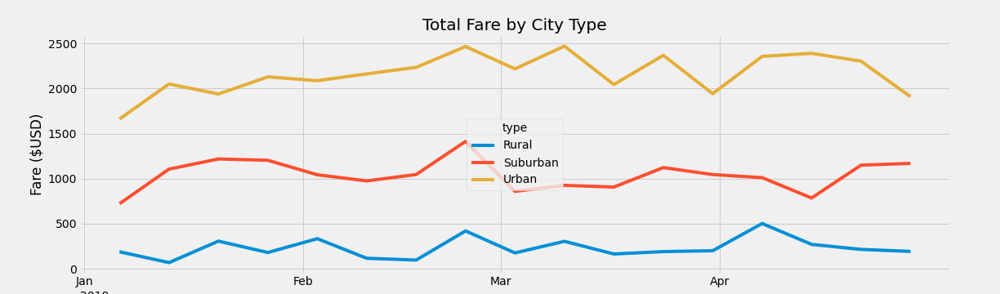

# PyBer Analysis

## Overview

### Purpose
Create a summary dataframe by turning the two provided csv data files into dataframes and combining them. Use pandas and matplotlib to create a chart that provides a comparative view of total weekly fares  based on city type. 

### Background
We have recieved a new assignment to create a summary dataframe of the provided ride-share data using python and pandas and make a graph to compare the total fares by city type together. 

## Results

The chart below will show a comparison of the total fares based on city type (urban, suburban, and rural.)

In the chart all three city types seem to have a generally **steady** fare, with **urban** being the **highest**, **suburban** in the **middle**, and **rural** the **lowest**.

## Summary
Though the total fares is highest in urban and lowest in rural city types, the opposite is the case for average fare. Rural cities have the higher average fare while urban cities have the lowest average fare of the three. Despite having the highest average fares per driver both demand and supply of rides are currently quite low for rural areas. One way to fix this could be to attract drivers to start doing rides in rural areas by letting them know about the higher average fares.
